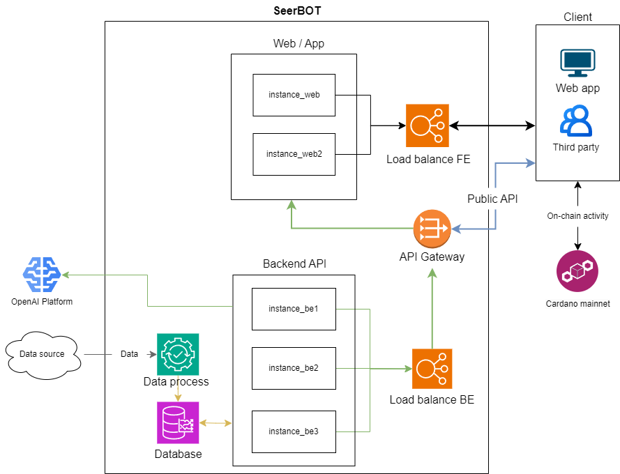
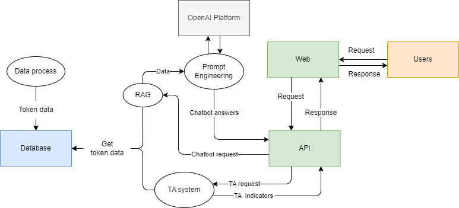

# System architecture 

## Web UI
### Web design:
// link figma

### User flow:
 

## Backend
### Data flow:

### I. API:
#### 1.1. Objective
Provide a compact, modular backend that exposes focused HTTPS API endpoints to support Cardano Catalyst workflows: market/pricing data, search and lookup utilities, AI-assisted analysis, trading-related helpers, and conversational interfaces. The design favors small, single-responsibility components that are easy to extend and integrate.

#### 1.2. Solutions
The project implements the objective by dividing responsibilities into independent components. Each component offers a clear API path for one area of functionality (data, analysis, search, chatbot). Components are orchestrated together by a minimal application entrypoint so they can run singly or as a combined service. The source code will be organized as a monorepo, making it easier to develop and maintain small projects.

#### 1.3. Features
- Modular component-based design with clear separation of concerns.
- Minimal application to combine components into a single running service.
- The project architecture is designed to be easily extended and add more features.
- Endpoints will cover features: 
  - pricing/market data
  - Technical analysis
  - AI chat bot

#### 1.4. Quality Assurance
- Tests, CI/CD, and linting to ensure code quality and reliability.
- Monitoring and alerts for production health.

### II. Data pipelines:
#### 2.1. Objective
Provide a reliable, maintainable data pipeline that ingests market and reference data, performs deterministic transforms and enrichment, and persists all outputs to the project database as the single source of truth. The pipeline emphasizes repeatability, observability, and safe scheduling so API endpoints can serve ready-to-query data on demand.

#### 2.2. Solutions
The data pipeline implements the following cooperating responsibilities:

- Ingestion and normalization: a scheduled crawler retrieves market/exchange data, normalizes timestamps and numeric fields, validates rows, and writes them to the database.
- Reference synchronization: a periodic sync refreshes currency/token metadata and market quotes so lookups and UIs use current information.
- Transform and materialization: windowed aggregations and enrichment transforms produce materialized tables and summaries used for low-latency queries.

An orchestration layer schedules these jobs, enforces dependency order (for example, refresh reference data before transforms), and handles retries and run metadata for observability.

#### 2.3. Features & Component roles (concise)

- Crawler / Ingest — scheduled, idempotent collection and normalization of market ticks/bars.
- Reference sync — periodic refresh of asset metadata and quotes for reliable lookups.
- Transform / Materialization — windowed aggregations and summaries for low-latency queries.
- Orchestration & reliability — job scheduling, dependency enforcement, retries, and run metadata.
- Data quality & observability — lightweight checks and metrics for dashboards and alerts.
- Persistence & serving — all outputs persisted to the database as the single source of truth.

#### 2.4. Quality Assurance
- Unit tests for transform logic to ensure deterministic correctness.
- Integration tests validating end-to-end ingestion, storage, and query workflows over a representative sample window.
- Logging and metrics: scheduled jobs emit start/stop, processed-record counts, and error signals for alerting.
- Safe deploys: schema changes and data migrations are rolled out in small, reversible steps and validated on staging data before production.

### Technical analysis:
[Details backtest 1](resources/backtests/backtest_report.md)

[Details backtest 2](resources/backtests/new_backtest_report.md)

### Docs
[Trade algorithm and AI integration plan](https://docs.google.com/document/d/1MLxm0QokDywJMqHItA40bd2RkJ77MbrSO9cghgu6C-c/edit?usp=sharing)
